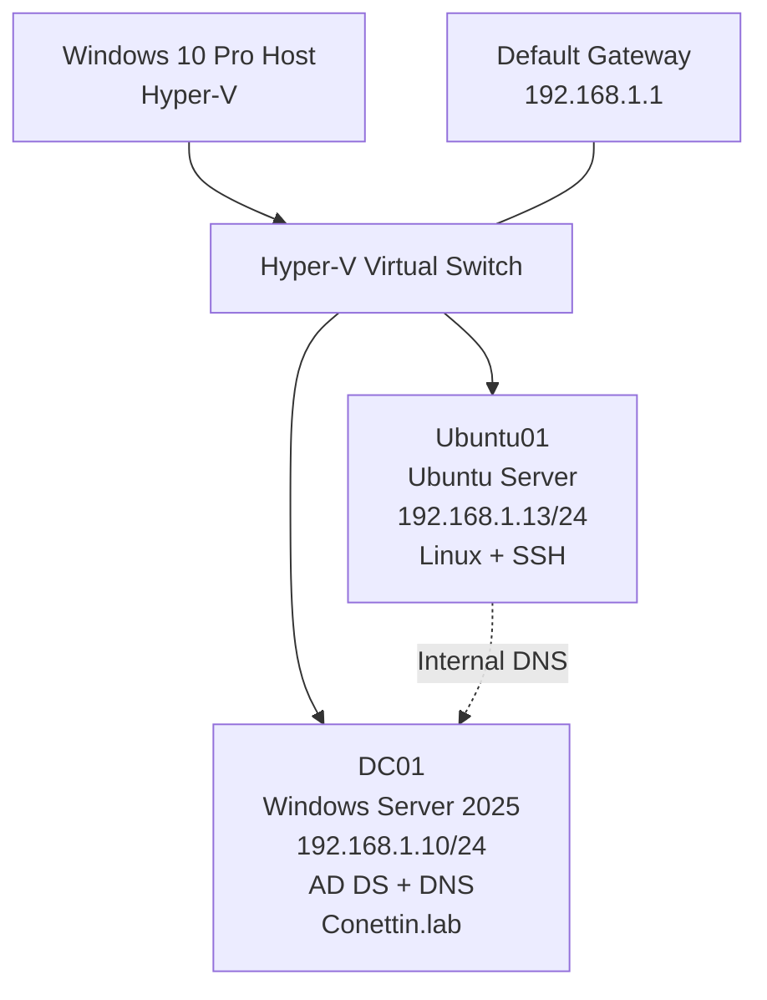

# Current Hybrid Infrastructure Lab Topology

## Overview

The current lab consists of a Windows 10 Pro Hyper-V host running
Windows Server and Ubuntu Server virtual machines.

DC01 provides Active Directory Domain Services and internal DNS,
while Ubuntu01 provides the Linux infrastructure environment.

## Architecture



## Network Configuration

| System | IPv4 Address | Gateway | DNS | Role |
|---|---|---|---|---|
| DC01 | `192.168.1.10/24` | `192.168.1.1` | `192.168.1.10` | AD DS / DNS |
| Ubuntu01 | `192.168.1.13/24` | `192.168.1.1` | `192.168.1.10` | Linux / SSH |

## DC01 Services

DC01 currently provides:

- Windows Server 2025
- Active Directory Domain Services
- Domain Controller
- DNS Server
- LDAP
- Kerberos
- Active Directory service discovery
- Domain: `Conettin.lab`

## Ubuntu01 Services

Ubuntu01 currently provides:

- Ubuntu Server
- Static IPv4 networking
- SSH remote administration
- Internal DNS resolution through DC01

## DNS Flow

Ubuntu01 uses DC01 as its internal DNS server.

```text
Ubuntu01
192.168.1.13
      │
      │ DNS Query
      ▼
DC01
192.168.1.10
      │
      ▼
Conettin.lab
      │
      ├── dc01.conettin.lab → 192.168.1.10
      ├── LDAP → dc01.conettin.lab:389
      └── Kerberos → dc01.conettin.lab:88
```

## Validation

The following infrastructure components have been validated:

- DC01 static IPv4 configuration
- Ubuntu01 static IPv4 configuration
- Default gateway connectivity
- DC01 ↔ Ubuntu01 IP connectivity
- Internal DNS resolution
- Active Directory DNS A records
- Active Directory LDAP SRV records
- Hostname-based connectivity from Ubuntu01 to DC01

## Current State

The local Active Directory and Linux infrastructure foundation is
operational.

DC01 and Ubuntu01 can communicate over IPv4, and Ubuntu01 can resolve
the private `Conettin.lab` namespace through the internal DNS server.

The environment is ready for the next infrastructure phase.