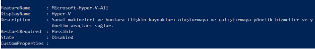
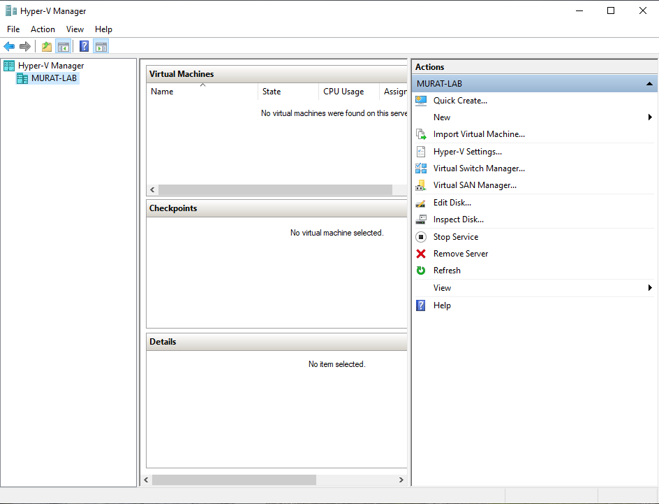
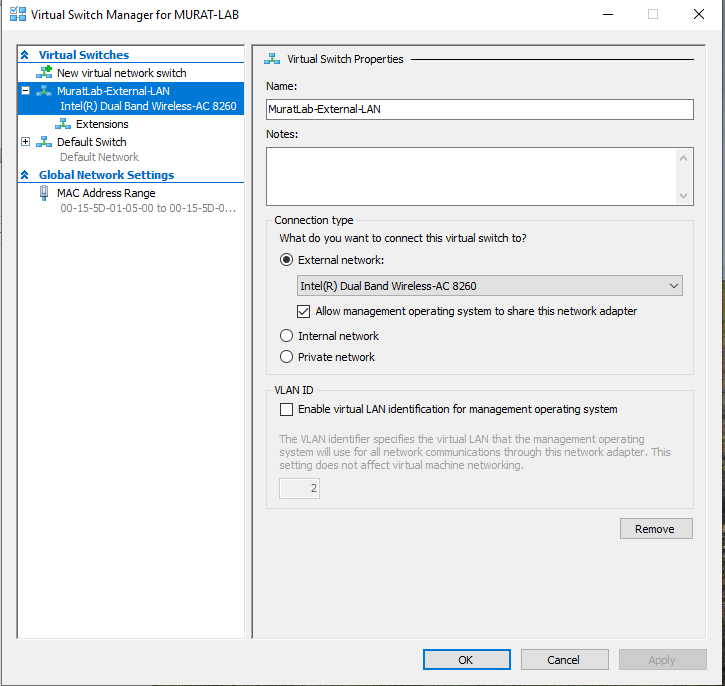
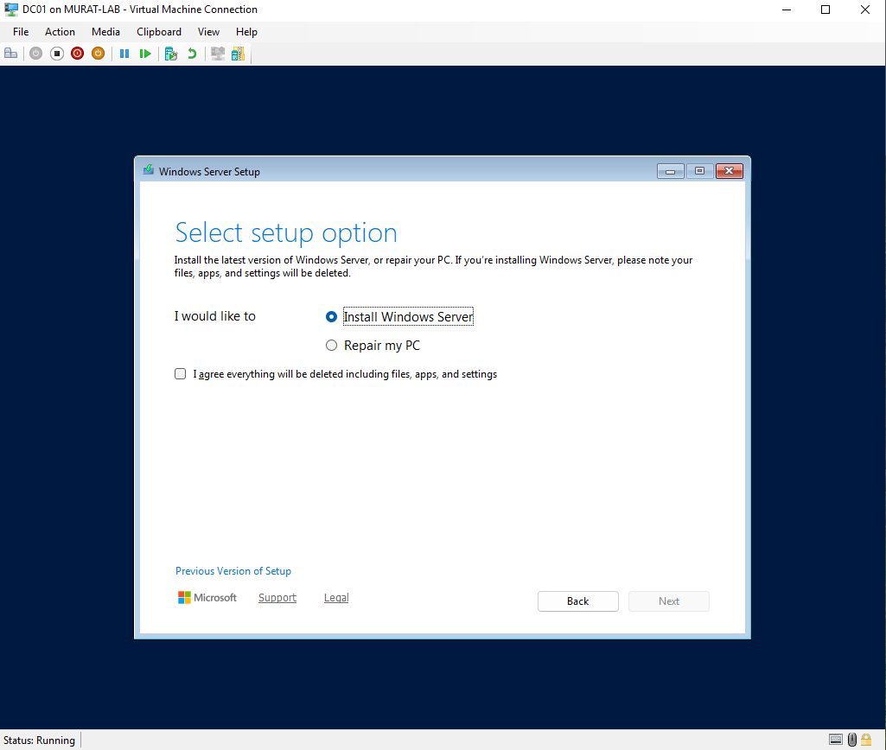
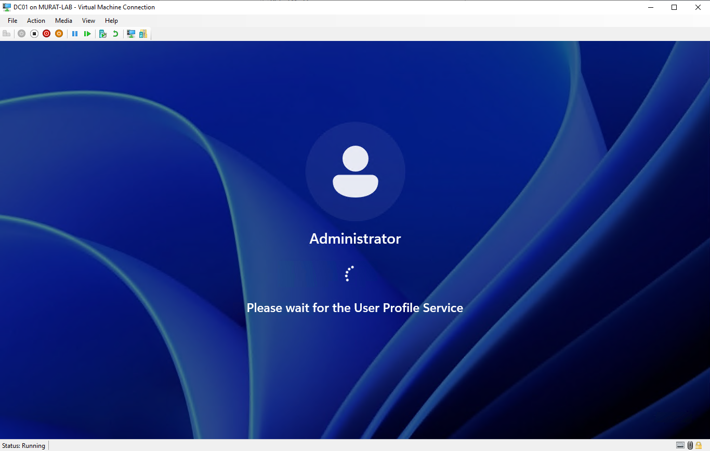
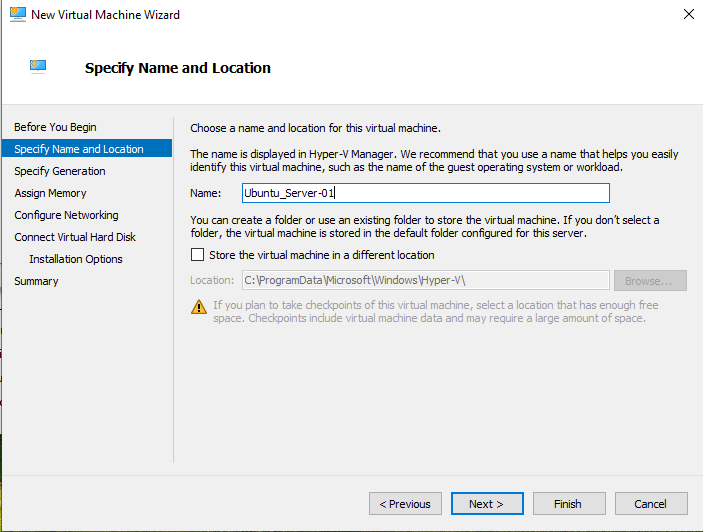
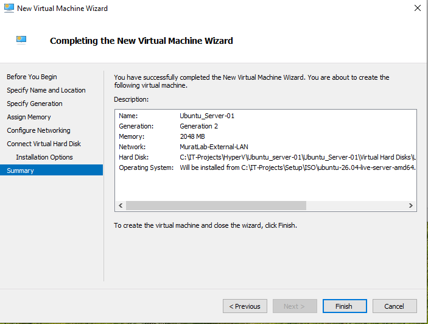

# Hyper-V Foundation

_______________________________________________________________

## Objective

Prepare the Windows host as the virtualization platform for the Hybrid Infrastructure Lab and create the initial virtual infrastructure required for Windows Server and Ubuntu Server.

_______________________________________________________________

## Environment

### Host

- Operating System: Windows 10 Pro
- Hypervisor: Microsoft Hyper-V
- Architecture: Local virtualization lab

### Planned Virtual Machines

| Virtual Machine | Operating System    | Purpose                                             |
|-----------------|---------------------|-----------------------------------------------------|
| DC01            | Windows Server 2025 | Active Directory Domain Services and DNS            |
| Ubuntu01        | Ubuntu Server       | Linux infrastructure and future container workloads |

_______________________________________________________________

## Host Validation

Before creating the virtual infrastructure, the host system was validated to confirm that hardware virtualization requirements were available.

System information was inspected before enabling and configuring Hyper-V.

The validation confirmed that the host supported the virtualization features required by Hyper-V.

### Implementation Evidence






_______________________________________________________________

## Hyper-V Installation

Hyper-V was enabled on the Windows host.

After installation, Hyper-V Manager was opened and validated.

This established the local virtualization platform used throughout the lab.

_______________________________________________________________

## Virtual Networking

A Hyper-V virtual switch was created to provide network connectivity for the lab virtual machines.

The virtual switch provides the network path used by:

```text
Windows Host
     │
   Hyper-V
     │
Virtual Switch
   ┌─┴───────────┐
   │             │
 DC01         Ubuntu01
```

This network later became the foundation for communication between the Domain Controller and the Linux server.

### Virtual Switch Evidence



_______________________________________________________________

## DC01 Virtual Machine

The first virtual machine was created for Windows Server.

The VM was prepared to become the main Windows infrastructure server for the lab.

Its planned responsibilities included:

- Active Directory Domain Services
- Domain Controller
- DNS Server
- Internal identity services
- Internal name resolution

Windows Server installation was then started inside the virtual machine.

### DC01 Deployment Evidence






_______________________________________________________________

## Ubuntu01 Virtual Machine

A second virtual machine was created for Ubuntu Server.

During VM creation, the following areas were configured:

- Virtual machine generation
- Memory
- Virtual switch connectivity
- Boot media
- Virtual storage

Ubuntu Server installation was then started.

### Ubuntu01 Deployment Evidence





_______________________________________________________________

## Validation

The Hyper-V environment was validated by successfully creating and starting both virtual machines.

The initial environment consisted of:

```text
Windows 10 Pro Host
        │
      Hyper-V
        │
 Hyper-V Virtual Switch
      ┌─┴─────────┐
      │           │
    DC01       Ubuntu01
```

Both virtual machines were able to boot successfully through Hyper-V.

_______________________________________________________________

## Result

The local virtualization foundation was successfully established.

The environment was ready for operating system configuration, network configuration and infrastructure service deployment.

_______________________________________________________________

## Lessons Learned

Hyper-V provides the virtualization layer that separates the infrastructure services from the physical host.

Virtual networking must be planned early because communication between servers depends on the virtual switch configuration.

Building the infrastructure in layers makes troubleshooting easier:

```text
Physical Host
     ↓
Hypervisor
     ↓
Virtual Network
     ↓
Virtual Machines
     ↓
Operating Systems
     ↓
Infrastructure Services
```
_______________________________________________________________

## Next Step

Deploy and configure Windows Server 2025 and Ubuntu Server before establishing network connectivity between the systems.