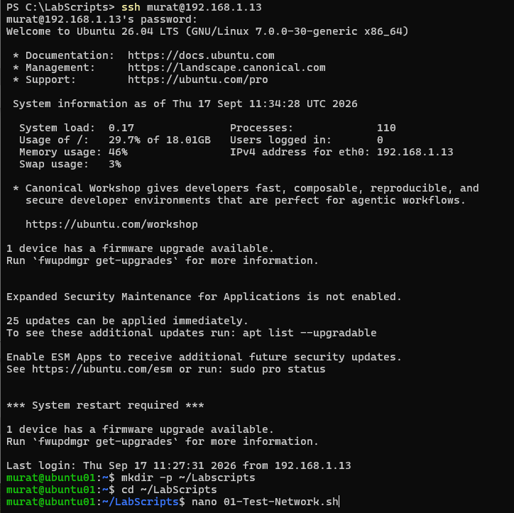

# Ubuntu Server Deployment

_______________________________________________________________

## Objective

Deploy Ubuntu Server as the Linux infrastructure server in the Hybrid Infrastructure Lab and prepare it for networking, remote administration and future container workloads.

_______________________________________________________________

## Environment

- Virtual Machine: Ubuntu01
- Operating System: Ubuntu Server
- Hypervisor: Microsoft Hyper-V
- Network Interface: `eth0`
- IPv4 Address: `192.168.1.13/24`
- Default Gateway: `192.168.1.1`
- Internal DNS Server: `192.168.1.10`
- Remote Administration: SSH

_______________________________________________________________

## Virtual Machine Deployment

Ubuntu01 was created as the second virtual machine in the Hyper-V environment.

During virtual machine creation, the following components were configured:

1. Virtual machine generation
2. Memory allocation
3. Hyper-V virtual switch
4. Installation media
5. Virtual storage
6. Boot configuration

Ubuntu Server was then installed and the initial system configuration was completed.

_______________________________________________________________

## Ubuntu Server Installation

The installation process included:

- Language selection
- Ubuntu Server installation type
- Initial network configuration
- Storage configuration
- User account configuration
- Password configuration
- SSH configuration
- System installation
- First login

After installation, Ubuntu01 was ready for network and remote administration configuration.

_______________________________________________________________

## Initial Network Validation

The network interfaces and assigned addresses were inspected using:

```bash
ip addr
```

Routing information was inspected using:

```bash
ip route
```

These commands were used to understand:

- Interface status
- IPv4 addressing
- Network prefix
- Default gateway
- Routing path

_______________________________________________________________

## Static IPv4 Configuration

Ubuntu01 was configured with a static IPv4 address:

```text
IPv4 Address    : 192.168.1.13/24
Default Gateway : 192.168.1.1
Interface       : eth0
```

Static addressing provides predictable network connectivity for infrastructure servers.

_______________________________________________________________

## Netplan Configuration

Ubuntu Server networking was managed using Netplan.

The available Netplan configuration was inspected using:

```bash
ls -l /etc/netplan/
```

The active configuration file was:

/etc/netplan/00-installer-config.yaml

The configuration was inspected using:

```bash
sudo cat /etc/netplan/00-installer-config.yaml
```

The initial configuration contained:

```yaml
network:
  version: 2
  ethernets:
    eth0:
      dhcp4: false
      addresses:
        - 192.168.1.13/24
      routes:
        - to: default
          via: 192.168.1.1
      nameservers:
        addresses:
          - 8.8.8.8
          - 1.1.1.1
```

At this stage, Ubuntu01 used public DNS resolvers.

This configuration provided external DNS resolution but could not resolve the private Active Directory namespace.

### Netplan Configuration Evidence


_______________________________________________________________

## SSH Remote Administration

SSH was enabled to provide remote command-line administration of Ubuntu01.

SSH service status was validated using:

```bash
sudo systemctl status ssh
```

Remote connectivity from DC01 to Ubuntu01 was also tested.

This allowed Ubuntu01 to be managed remotely instead of relying only on the Hyper-V console.


### SSH connection



_______________________________________________________________

## System Updates

The Ubuntu package repositories and installed packages were updated during the initial server preparation.

The package upgrade process was performed using:

```bash
sudo apt upgrade
```

This ensured that the server had current package updates before additional infrastructure services were deployed.

_______________________________________________________________

## Internal DNS Integration

After DC01 networking and DNS were corrected, Ubuntu01 was changed to use the internal Active Directory DNS server.

Before modifying the configuration, a backup of the Netplan file was created:

```bash
sudo cp /etc/netplan/00-installer-config.yaml \
/etc/netplan/00-installer-config.yaml.bak
```

The Netplan configuration was edited using:

```bash
sudo nano /etc/netplan/00-installer-config.yaml
```

The DNS configuration was changed from:

```yaml
nameservers:
  addresses:
    - 8.8.8.8
    - 1.1.1.1
```
to:

```yaml
nameservers:
  addresses:
    - 192.168.1.10
```

The configuration was validated before being applied:

```bash
sudo netplan generate
```

The new network configuration was then applied:

```bash
sudo netplan apply
```

_______________________________________________________________

## DNS Validation

The active resolver configuration was inspected using:

```bash
resolvectl status
```

The active DNS server was confirmed as:

192.168.1.10

Internal DNS resolution was tested using:

```bash
nslookup dc01.conettin.lab
```

The query successfully resolved:

dc01.conettin.lab → 192.168.1.10

Hostname-based connectivity was then tested:

```bash
ping -c 4 dc01.conettin.lab
```

All four packets were successfully received with 0% packet loss.

_______________________________________________________________

## Final Network Configuration

Ubuntu01 currently uses:

```text
Hostname        : Ubuntu01
Interface       : eth0
IPv4 Address    : 192.168.1.13/24
Default Gateway : 192.168.1.1
DNS Server      : 192.168.1.10
Remote Access   : SSH
```

_______________________________________________________________

## Validation

The following components were successfully validated:

- Ubuntu Server installation
- Static IPv4 configuration
- Default route
- SSH service
- Package updates
- Netplan configuration
- Internal DNS configuration
- DC01 hostname resolution
- DC01 network connectivity

_______________________________________________________________

## Result

Ubuntu01 is operational as the Linux infrastructure server in the lab.

The server has static IPv4 networking, SSH remote administration and internal DNS resolution through DC01.

Ubuntu01 is ready for future Linux infrastructure and container workloads.

_______________________________________________________________

## Lessons Learned

Linux infrastructure servers should use predictable network configuration.

Netplan provides declarative network configuration on Ubuntu Server.

Network configuration should be validated before applying changes:

```text
Edit Configuration
        ↓
netplan generate
        ↓
netplan apply
        ↓
resolvectl status
        ↓
DNS / Connectivity Tests
```

Internal systems that need to resolve an Active Directory namespace must use the internal DNS infrastructure instead of public DNS resolvers.

_______________________________________________________________

## Next Step

Complete infrastructure validation and prepare Ubuntu01 for future container workloads.
