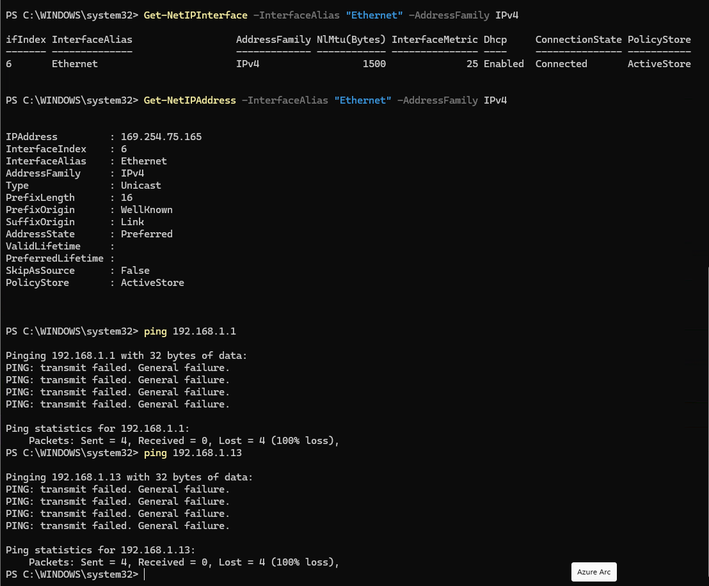
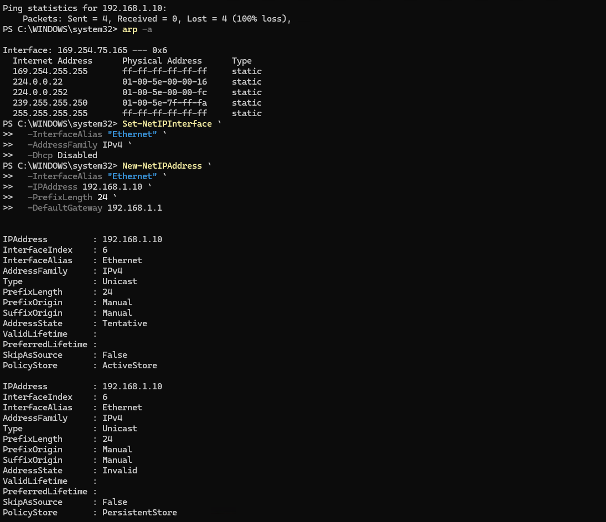
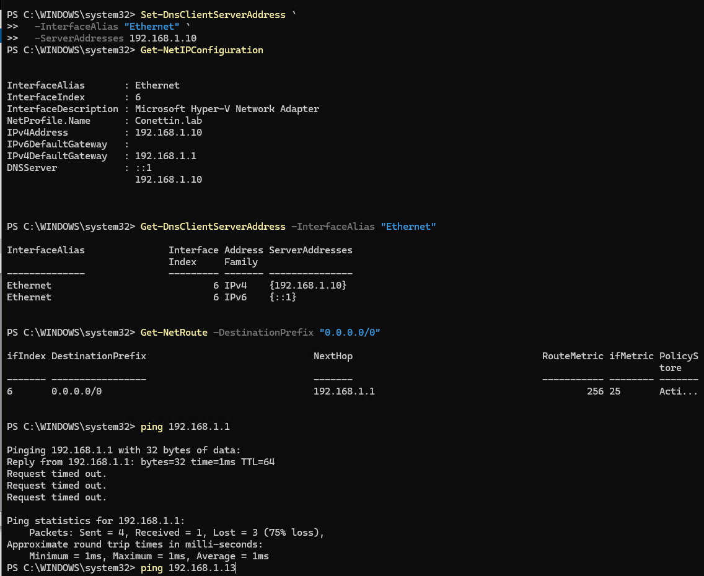
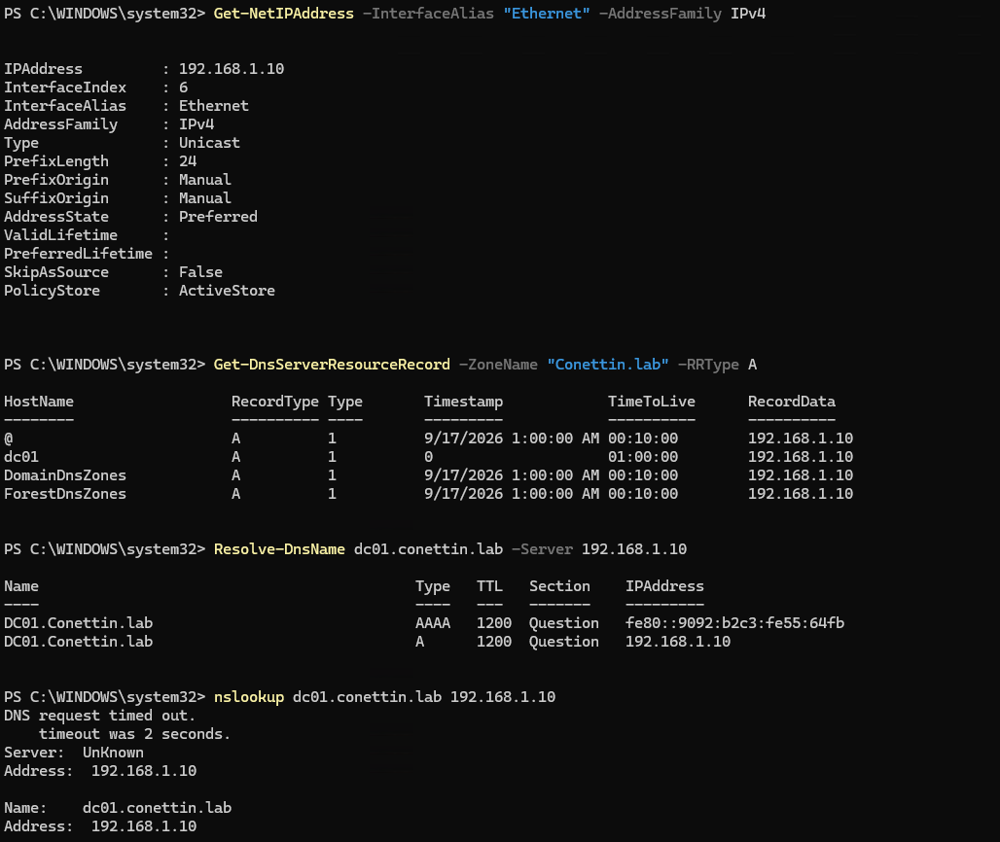
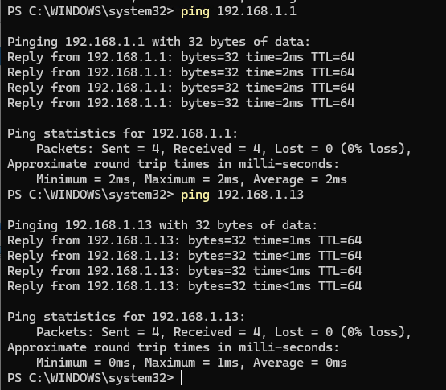

# Virtual Networking and Connectivity

_______________________________________________________________

## Objective

Establish reliable IPv4 connectivity between DC01 and Ubuntu01 and troubleshoot the network path before configuring higher-level services such as Active Directory DNS.

_______________________________________________________________

## Network Environment

The lab network consists of:

- Windows 10 Pro Hyper-V host
- Hyper-V virtual switch
- DC01
- Ubuntu01
- Local network gateway

Final working addressing:

| System   | IPv4 Address    | Default Gateway |
|----------|-----------------|-----------------|
| DC01     | 192.168.1.10/24 | 192.168.1.1     |
| Ubuntu01 | 192.168.1.13/24 | 192.168.1.1     |

_______________________________________________________________

## Ubuntu01 Network Investigation

Ubuntu01 network information was inspected using:

```bash
ip addr
```

The command was used to identify:

- Network interface
- IPv4 address
- Prefix length
- Interface state

Routing was inspected using:

```bash
ip route
```

The working configuration included:

default via 192.168.1.1
192.168.1.0/24

_______________________________________________________________

## Connectivity Testing

Connectivity between Ubuntu01 and DC01 was tested using `ping`.

Neighbor and ARP information was also investigated using:

```bash
ip neigh show
```

and:

```bash
arp -a
```

These tests helped identify whether systems on the local network could discover and communicate with each other.

_______________________________________________________________

## Firewall Validation

During connectivity troubleshooting, firewall behavior was also investigated.

A firewall rule was enabled during testing to verify whether ICMP traffic was affecting communication between the systems.

This helped separate firewall-related connectivity issues from IP addressing and routing issues.

_______________________________________________________________

## IP Conflict Investigation

During the networking phase, a possible IP conflict was investigated.

Addressing, routing and neighbor information were compared before the final static addressing scheme was established.

The final addressing scheme became:

```text
Default Gateway    192.168.1.1
DC01               192.168.1.10
Ubuntu01           192.168.1.13
```

_______________________________________________________________

## DC01 Network Problem

During Active Directory and DNS validation, DC01 was found with an APIPA address:

169.254.75.165/16

The network adapter itself was operational.

Adapter status was inspected using:

```powershell
Get-NetAdapter
```

The adapter reported:

Status: Up

Network configuration was inspected using:

```powershell
Get-NetIPConfiguration
```

The results showed:

- APIPA IPv4 address
- No IPv4 default gateway
- No working IPv4 default route

DNS client configuration was inspected using:

```powershell
Get-DnsClientServerAddress -AddressFamily IPv4
```

The default route was checked using:

```powershell
Get-NetRoute -DestinationPrefix "0.0.0.0/0"
```

No IPv4 default route was found.

### Initial Network Issue



_______________________________________________________________

## DC01 IPv4 Investigation

The interface configuration was examined using:

```powershell
Get-NetIPInterface -InterfaceAlias "Ethernet" -AddressFamily IPv4
```

The interface was connected and DHCP was enabled.

The assigned IPv4 address was inspected using:

```powershell
Get-NetIPAddress -InterfaceAlias "Ethernet" -AddressFamily IPv4
```

DC01 was using the APIPA address instead of an address from the 192.168.1.0/24 network.

Connectivity tests to both the gateway and Ubuntu01 initially failed:

```powershell
ping 192.168.1.1
ping 192.168.1.13
```

This confirmed that the problem existed below the DNS layer.

_______________________________________________________________

## Static IPv4 Configuration

DHCP was disabled on the DC01 Ethernet interface:

```powershell
Set-NetIPInterface `
  -InterfaceAlias "Ethernet" `
  -AddressFamily IPv4 `
  -Dhcp Disabled
```

A static IPv4 configuration was then assigned:

```powershell
New-NetIPAddress `
  -InterfaceAlias "Ethernet" `
  -IPAddress 192.168.1.10 `
  -PrefixLength 24 `
  -DefaultGateway 192.168.1.1
```

DC01 DNS client configuration was changed to use the internal DNS server running locally on DC01:

```powershell
Set-DnsClientServerAddress `
  -InterfaceAlias "Ethernet" `
  -ServerAddresses 192.168.1.10
```
### DC01 Static IPv4 Configuration




_______________________________________________________________

## Route Validation

After static addressing was configured, the default route was validated using:

```powershell
Get-NetRoute -DestinationPrefix "0.0.0.0/0"
```

The resulting route pointed to:

0.0.0.0/0 → 192.168.1.1

_______________________________________________________________

## Connectivity Validation

After the network configuration settled, connectivity was tested again.

Gateway:

```powershell
ping 192.168.1.1
```

Ubuntu01:

```powershell
ping 192.168.1.13
```

Both tests completed successfully with:

Sent     : 4
Received : 4
Lost     : 0

This confirmed working IPv4 connectivity between DC01, Ubuntu01 and the local gateway.

### Connectivity Validation




_______________________________________________________________

## Troubleshooting Approach

The network issue was investigated from the lower infrastructure layers upward.

```text
Network Adapter
      ↓
Interface State
      ↓
IPv4 Address
      ↓
Subnet
      ↓
Default Gateway
      ↓
Default Route
      ↓
Peer Connectivity
      ↓
DNS
```

This prevented DNS configuration from being changed before the underlying network problem was understood.

_______________________________________________________________

## Root Cause

DC01 did not have a valid IPv4 configuration for the local `192.168.1.0/24` network.

The server had fallen back to an APIPA address and did not have a working default gateway or default route.

_______________________________________________________________

## Resolution

DC01 was assigned a static IPv4 configuration:

IPv4 Address    : 192.168.1.10/24
Default Gateway : 192.168.1.1
DNS Server      : 192.168.1.10

Ubuntu01 retained:

IPv4 Address    : 192.168.1.13/24
Default Gateway : 192.168.1.1

_______________________________________________________________

## Result

Layer 3 connectivity between the infrastructure servers is operational.

```text
              192.168.1.1
              Gateway
                 │
                 │
        ┌────────┴────────┐
        │                 │
      DC01             Ubuntu01
  192.168.1.10       192.168.1.13
        │                 │
        └──── IPv4 ───────┘
```

_______________________________________________________________

## Lessons Learned

A DNS failure does not necessarily indicate a DNS Server problem.

Before troubleshooting application or directory services, validate:

1. Network adapter state
2. IP addressing
3. Subnet
4. Default gateway
5. Routing
6. Peer connectivity
7. DNS configuration

An APIPA address (`169.254.0.0/16`) is an important indicator that the system does not currently have the expected IPv4 configuration.

Infrastructure services such as Domain Controllers should use predictable static network addressing.

_______________________________________________________________

## Next Step

Validate Active Directory and DNS after establishing reliable network connectivity.
