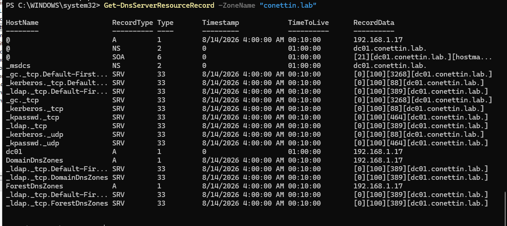
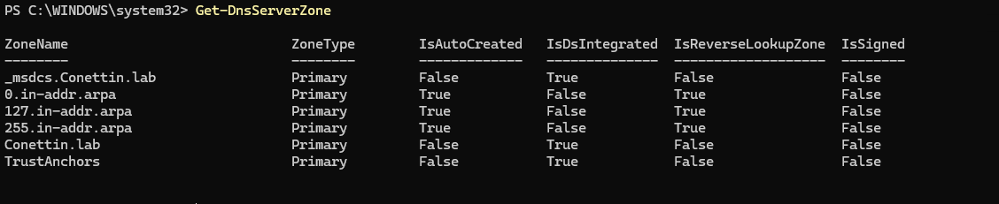
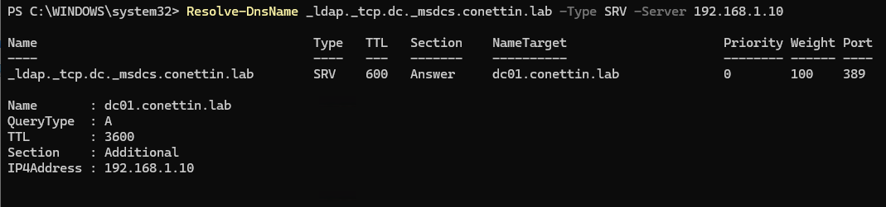
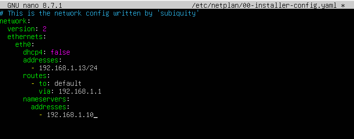
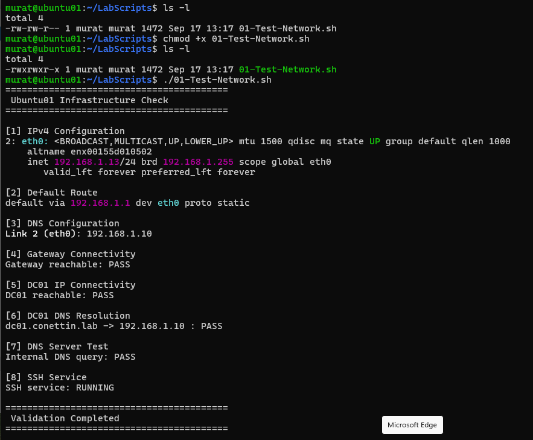

# Active Directory DNS

_______________________________________________________________

## Objective

Validate Active Directory-integrated DNS and enable internal name resolution between DC01 and Ubuntu01.

_______________________________________________________________

## Initial Findings

Active Directory and DNS services were successfully installed.

The DNS service was validated using:

```powershell
Get-Service DNS
```

The DNS Server service was confirmed as running.

DNS resource records were inspected using:

```powershell
Get-DnsServerResourceRecord -ZoneName "Conettin.lab"
```

DNS resource records included:

- NS
- SOA
- LDAP SRV
- Kerberos SRV
- Global Catalog SRV

Example Active Directory service discovery record:

_ldap._tcp.dc._msdcs.conettin.lab

The SRV record identifies the Domain Controller providing LDAP services for the domain.

DNS zones were inspected using:

```powershell
Get-DnsServerZone
```

The Active Directory DNS zones were successfully detected.

### DNS Infrastructure Evidence




_______________________________________________________________

## Problem

Internal DNS resolution was not working correctly.

DC01 reported an APIPA IPv4 address:

169.254.x.x

DC01 also did not have a valid default route.

Ubuntu01 was configured with:

IPv4:   192.168.1.13/24
Gateway: 192.168.1.1
DNS:     8.8.8.8, 1.1.1.1

As a result, Ubuntu01 could not resolve the private `Conettin.lab` Active Directory DNS namespace.

_______________________________________________________________

## Investigation

The troubleshooting process validated the infrastructure in the following order:

1. Network adapter status
2. IPv4 configuration
3. Subnet configuration
4. Default gateway
5. Default route
6. DNS client configuration
7. DNS resource records
8. Internal name resolution
9. Active Directory service discovery

The DC01 network adapter was operational, but the server was using an APIPA address and had no valid default gateway or default route.

_______________________________________________________________

## Root Cause

The DNS issue was caused by incomplete network and DNS client configuration.

DC01 had received an APIPA address instead of a valid static IPv4 address and did not have a working default route.

Ubuntu01 was configured to use public DNS resolvers, which cannot resolve the private `Conettin.lab` Active Directory namespace.

_______________________________________________________________

## Resolution

DC01 was configured with the following static network settings:

- IPv4 address: `192.168.1.10/24`
- Default gateway: `192.168.1.1`
- DNS server: `192.168.1.10`

Ubuntu01 retained its existing static network configuration:

- IPv4 address: `192.168.1.13/24`
- Default gateway: `192.168.1.1`

The Ubuntu01 DNS configuration was changed from public DNS resolvers to the internal DNS server:

192.168.1.10

The Netplan configuration was validated and applied using:

```bash
sudo netplan generate
sudo netplan apply
```
### DC01 Network and DNS Correction


_______________________________________________________________

## Validation

DC01 network connectivity was validated using:

```powershell
ping 192.168.1.1
ping 192.168.1.13
```

Both the default gateway and Ubuntu01 responded successfully.

DC01 DNS A records were validated using:

```powershell
Get-DnsServerResourceRecord -ZoneName "Conettin.lab" -RRType A
```

The DNS record for DC01 correctly resolved to:

dc01.conettin.lab → 192.168.1.10

Forward DNS resolution was validated using:

```powershell
Resolve-DnsName dc01.conettin.lab -Server 192.168.1.10
```

Active Directory LDAP service discovery was validated using:

```powershell
Resolve-DnsName _ldap._tcp.dc._msdcs.conettin.lab -Type SRV -Server 192.168.1.10
```

The LDAP SRV record successfully returned:

```text
Server : dc01.conettin.lab
IPv4   : 192.168.1.10
Port   : 389
```

Ubuntu01 DNS configuration was validated using:

```bash
resolvectl status
```

The active DNS server was confirmed as:

192.168.1.10

Internal name resolution was then tested from Ubuntu01:

```bash
nslookup dc01.conettin.lab
```

The query successfully returned:

```text
dc01.conettin.lab
Address: 192.168.1.10
```

Finally, hostname-based connectivity was validated:

```bash
ping -c 4 dc01.conettin.lab
```

All four packets were successfully received with 0% packet loss.


### DC01 DNS Validation





### Ubuntu01 DNS Validation



### Final Infrastructure Validation


_______________________________________________________________

## Lessons Learned

Active Directory depends heavily on DNS for domain and service discovery.

DNS troubleshooting should begin with the underlying network configuration before investigating DNS records or higher-level services.

The troubleshooting path used in this lab was:

```text
Network Adapter
      ↓
IP Address
      ↓
Subnet
      ↓
Default Gateway
      ↓
Routing
      ↓
DNS Server
      ↓
DNS Records
      ↓
Name Resolution
      ↓
Active Directory Service Discovery
```

Public DNS resolvers cannot resolve a private Active Directory DNS namespace such as `Conettin.lab`.

Systems that need to communicate with Active Directory should use the internal Active Directory DNS infrastructure for domain name resolution.

_______________________________________________________________

## Status

Internal IPv4 connectivity and Active Directory DNS resolution between DC01 and Ubuntu01 are operational.
