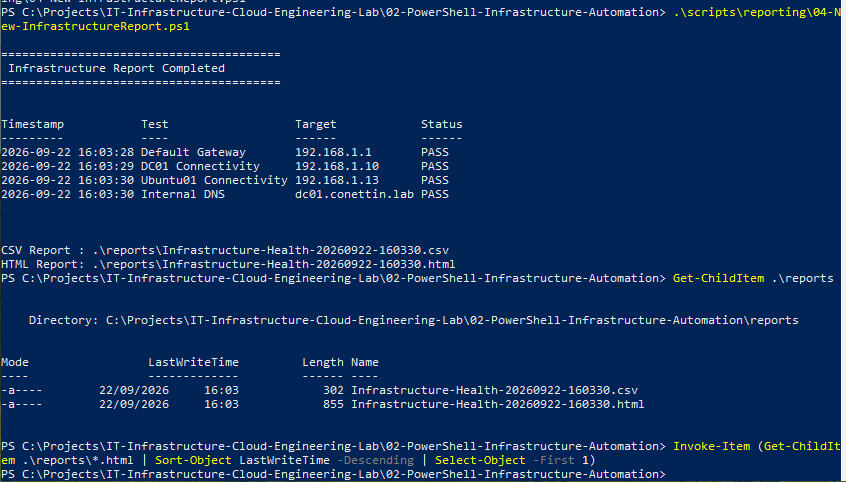
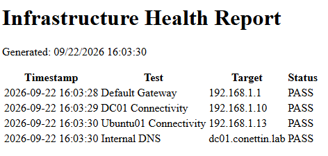

<-- Back to Main Repository:
[IT Infrastructure Cloud Engineering Lab](../README.md)

# 02-PowerShell-Infrastructure-Automation

## Prerequisites

Before starting this lab:

- Completed `01-Hybrid-Infrastructure-Lab`
- Basic knowledge of Windows and Linux administration
- Basic understanding of TCP/IP and DNS
- Basic PowerShell knowledge
- Windows PowerShell 5.1
- Hyper-V lab environment
- Windows Server 2025 Domain Controller
- Active Directory Domain Services
- DNS Server
- Ubuntu Server

The infrastructure used by this project:

| System | Role | IPv4 |
|---|---|---|
| Host | Hyper-V Host | `192.168.1.3` |
| DC01 | AD DS / DNS | `192.168.1.10` |
| Ubuntu01 | Linux Server | `192.168.1.13` |
| Gateway | Network Gateway | `192.168.1.1` |

Active Directory domain:

```text
conettin.lab
```

____________________________________________________________

## What You Will Build

This project converts manual infrastructure administration and validation
tasks into reusable PowerShell automation.

The lab includes:

- Windows system inventory automation
- Network connectivity validation
- Active Directory health validation
- DNS validation
- Active Directory service discovery validation
- Standardized PASS/FAIL health checks
- Centralized infrastructure configuration
- CSV infrastructure reporting
- HTML infrastructure reporting
- Reusable PowerShell scripts
- Technical documentation

The project builds on the infrastructure created in
`01-Hybrid-Infrastructure-Lab` and provides the PowerShell automation
foundation for later projects in the main engineering roadmap.

____________________________________________________________

## Overview

This project demonstrates PowerShell-based infrastructure automation in a
hybrid Windows Server and Linux lab environment.

It builds on the infrastructure created in the
`01-Hybrid-Infrastructure-Lab` project and converts manual infrastructure
validation tasks into reusable PowerShell automation.

The project includes system discovery, network health checks, Active
Directory and DNS validation, centralized configuration, and automated
CSV/HTML reporting.

The objective is to move from individual administrative commands toward
repeatable and structured infrastructure automation.

____________________________________________________________

## Objectives

The main objectives of this project are:

- Automate Windows system inventory collection
- Validate infrastructure network connectivity
- Automate Active Directory health checks
- Validate internal DNS resolution
- Validate Active Directory service discovery
- Standardize infrastructure checks using PASS/FAIL results
- Generate structured CSV and HTML reports
- Separate infrastructure configuration from automation logic
- Build reusable PowerShell automation practices

____________________________________________________________

## Automation Workflow

The project follows the following automation workflow:

```text
              Hybrid Infrastructure
                       |
          +------------+-------------+
          |                          |
          v                          v
     Windows Host                   DC01
          |                          |
          v                          v
  System Discovery            AD / DNS Validation
          |                          |
          +------------+-------------+
                       |
                       v
               Network Validation
                       |
                       v
               Structured Objects
                       |
                +------+------+
                |             |
                v             v
               CSV           HTML
                |             |
                +------+------+
                       |
                       v
                    Reports
```

The workflow demonstrates the transition from manual infrastructure
administration to structured PowerShell-based validation and reporting.

____________________________________________________________

## Project Structure

```text
02-PowerShell-Infrastructure-Automation/
|
|-- README.md
|
|-- configs/
|   `-- infrastructure.json
|
|-- docs/
|   |-- 01-powershell-automation.md
|   |-- 02-infrastructure-health-checks.md
|   `-- 03-reporting-and-configuration.md
|
|-- scripts/
|   |-- discovery/
|   |   `-- 01-Get-SystemInventory.ps1
|   |
|   |-- monitoring/
|   |   `-- 02-Test-NetworkHealth.ps1
|   |
|   |-- active-directory/
|   |   `-- 03-Test-ADDSHealth.ps1
|   |
|   `-- reporting/
|       `-- 04-New-InfrastructureReport.ps1
|
|-- reports/
|   |-- Infrastructure-Health-<timestamp>.csv
|   `-- Infrastructure-Health-<timestamp>.html
|
`-- screenshots/
    |-- 01-System-Inventory.PNG
    |-- 02-Network-Health-Check.PNG
    |-- 03-ADDS-DNS-Health-Check.PNG
    |-- 04-Infrastructure-Report-Execution.PNG
    `-- 05-Infrastructure-Health-HTML-Report.PNG
```

The project separates automation scripts, configuration, documentation,
reports and implementation evidence into dedicated directories.

____________________________________________________________

## System Inventory Automation

The first automation script collects system, hardware, storage and network
information from the Windows host.

Script:

```text
scripts/discovery/01-Get-SystemInventory.ps1
```

The script collects:

- Computer name
- Manufacturer
- Hardware model
- Operating system
- OS version
- OS build number
- Architecture
- CPU
- Physical processors
- Logical processors
- Installed memory
- Disk capacity
- Available disk space
- IPv4 address
- Default gateway
- DNS servers
- PowerShell version

Key PowerShell technologies used include:

```powershell
Get-CimInstance
Get-NetIPAddress
Get-NetRoute
Get-DnsClientServerAddress
```

Information from multiple PowerShell commands is consolidated into a
structured object using:

```powershell
[PSCustomObject]
```

### Validation


Detailed documentation:

[PowerShell Infrastructure Automation](docs/01-powershell-automation.md)

____________________________________________________________

## Infrastructure Health Monitoring

The network health script automatically validates connectivity between the
core components of the hybrid lab.

Script:

```text
scripts/monitoring/02-Test-NetworkHealth.ps1
```

The following targets are validated:

| Target | Address |
|---|---|
| Default Gateway | `192.168.1.1` |
| DC01 | `192.168.1.10` |
| Ubuntu01 | `192.168.1.13` |

Connectivity is tested using:

```powershell
Test-Connection
```

Internal DNS resolution is validated for:

```text
dc01.conettin.lab
```

using:

```powershell
Resolve-DnsName
```

The script converts the validation results into standardized:

```text
PASS
FAIL
```

states.

### Validation


The completed validation returned:

```text
Default Gateway          PASS
DC01 Connectivity        PASS
Ubuntu01 Connectivity    PASS
Internal DNS Resolution  PASS
```

Detailed documentation:

[Infrastructure Health Checks](docs/02-infrastructure-health-checks.md)

____________________________________________________________

## Active Directory and DNS Automation

The Active Directory health validation script runs against the DC01
environment.

Script:

```text
scripts/active-directory/03-Test-ADDSHealth.ps1
```

The script validates:

- Active Directory domain
- AD DS / NTDS service
- DNS service
- Domain Controller DNS resolution
- LDAP SRV service discovery record

The Active Directory domain is validated using:

```powershell
Get-ADDomain
```

Core infrastructure services are validated using:

```powershell
Get-Service NTDS
Get-Service DNS
```

Domain Controller DNS resolution is validated for:

```text
dc01.conettin.lab
```

The Active Directory LDAP service discovery record is also validated:

```text
_ldap._tcp.dc._msdcs.conettin.lab
```

### Validation


The completed validation returned:

```text
Active Directory Domain   PASS
AD DS Service             PASS
DNS Service               PASS
DC DNS Resolution         PASS
LDAP SRV Record           PASS
```

This confirms that the core Active Directory and DNS services used by the
lab are operational.

____________________________________________________________

## Centralized Configuration

Infrastructure information is stored separately from the automation
scripts in:

```text
configs/infrastructure.json
```

The configuration contains:

- Active Directory domain
- Domain Controller name
- Domain Controller FQDN
- Domain Controller IPv4 address
- Ubuntu server name
- Ubuntu server IPv4 address
- Default gateway

Example configuration:

```json
{
    "domain": "conettin.lab",
    "domainController": {
        "name": "dc01",
        "fqdn": "dc01.conettin.lab",
        "ip": "192.168.1.10"
    },
    "ubuntuServer": {
        "name": "ubuntu01",
        "ip": "192.168.1.13"
    },
    "network": {
        "gateway": "192.168.1.1"
    }
}
```

PowerShell can load the configuration using:

```powershell
$Config = Get-Content .\configs\infrastructure.json |
    ConvertFrom-Json
```

Configuration values can then be accessed as object properties.

Example:

```powershell
$Config.domainController.ip
```

Output:

```text
192.168.1.10
```

Separating infrastructure configuration from automation logic provides a
foundation for reducing hard-coded values and building more reusable
automation.

____________________________________________________________

## Infrastructure Reporting

The reporting script performs infrastructure health checks and generates
structured reports.

Script:

```text
scripts/reporting/04-New-InfrastructureReport.ps1
```

The following infrastructure checks are included:

- Default gateway connectivity
- DC01 connectivity
- Ubuntu01 connectivity
- Internal DNS resolution

Each result contains:

- Timestamp
- Test
- Target
- Status

Example:

```text
Timestamp             Test                    Target             Status
2026-09-22 16:03:28   Default Gateway         192.168.1.1        PASS
2026-09-22 16:03:29   DC01 Connectivity       192.168.1.10       PASS
2026-09-22 16:03:30   Ubuntu01 Connectivity   192.168.1.13       PASS
2026-09-22 16:03:30   Internal DNS            dc01.conettin.lab  PASS
```

____________________________________________________________

## CSV Reporting

Infrastructure health results are exported using:

```powershell
Export-Csv
```

Reports are stored under:

```text
reports/
```

Example report:

```text
Infrastructure-Health-20260922-160330.csv
```

CSV output provides structured data that can later be used for:

- Historical analysis
- Health comparisons
- Further PowerShell processing
- Data analysis
- Monitoring integrations

____________________________________________________________

## HTML Reporting

The same structured PowerShell results are converted into an HTML report
using:

```powershell
ConvertTo-Html
```

Example report:

```text
Infrastructure-Health-20260922-160330.html
```

### Report Execution



The PowerShell reporting script successfully generated both CSV and HTML
output files.

### HTML Report



The HTML report provides a simple human-readable infrastructure health
summary containing:

```text
Timestamp
Test
Target
Status
```

Detailed documentation:

[Reporting and Configuration](docs/03-reporting-and-configuration.md)

____________________________________________________________

## PowerShell Concepts Used

The project demonstrates practical use of several PowerShell concepts:

- Variables
- PowerShell objects
- `PSCustomObject`
- Pipelines
- Arrays
- Hashtables
- `foreach`
- `if / else`
- `try / catch`
- CIM
- Network cmdlets
- Active Directory cmdlets
- DNS cmdlets
- JSON configuration
- CSV export
- HTML generation

These concepts form the foundation for more advanced infrastructure
automation.

____________________________________________________________

## Key Cmdlets

Important PowerShell cmdlets used throughout the project include:

```powershell
Get-CimInstance
Get-NetIPAddress
Get-NetRoute
Get-DnsClientServerAddress
Test-Connection
Resolve-DnsName
Get-ADDomain
Get-Service
Get-Content
ConvertFrom-Json
Export-Csv
ConvertTo-Html
```

____________________________________________________________

## Documentation

Detailed implementation notes are available under the `docs` directory.

### PowerShell Automation

[01-powershell-automation.md](docs/01-powershell-automation.md)

Covers:

- System inventory automation
- PowerShell pipeline usage
- Structured PowerShell objects
- Inventory validation

### Infrastructure Health Checks

[02-infrastructure-health-checks.md](docs/02-infrastructure-health-checks.md)

Covers:

- Network health validation
- DC01 connectivity
- Ubuntu01 connectivity
- Internal DNS validation
- Active Directory health validation
- LDAP SRV validation

### Reporting and Configuration

[03-reporting-and-configuration.md](docs/03-reporting-and-configuration.md)

Covers:

- Centralized JSON configuration
- PowerShell configuration loading
- Structured health results
- CSV report generation
- HTML report generation

____________________________________________________________

## Implementation Evidence

Screenshots are included selectively to demonstrate the main automation
and validation stages.

### System Inventory


### Network Health Validation


### Active Directory and DNS Validation


### Infrastructure Report Generation


### Generated HTML Health Report


____________________________________________________________

## Results

The project successfully converts several manual infrastructure
administration tasks into reusable PowerShell automation.

The completed workflow provides:

- Automated Windows system discovery
- Automated network connectivity validation
- Automated Active Directory validation
- Automated DNS validation
- Active Directory service discovery validation
- Standardized PASS/FAIL health results
- Centralized infrastructure configuration
- Structured PowerShell objects
- CSV report generation
- HTML report generation

The project demonstrates the transition from manual infrastructure
administration toward repeatable, structured and reusable automation.

____________________________________________________________

## Skills Demonstrated

- PowerShell automation
- Windows infrastructure administration
- Infrastructure discovery
- Network validation
- Active Directory administration
- DNS troubleshooting and validation
- Active Directory service discovery
- PowerShell object handling
- Conditional logic
- Error handling
- Configuration management
- Infrastructure health monitoring
- CSV reporting
- HTML reporting
- Technical documentation

____________________________________________________________

## Next Steps

This project provides the PowerShell automation foundation for later
infrastructure engineering projects.

The next stages of the main engineering roadmap expand the environment
toward:

- Microsoft Azure
- Terraform
- Docker
- Kubernetes
- Database and SQL engineering
- CI/CD
- Monitoring and observability
- SRE and reliability engineering
- Enterprise infrastructure integration

<-- Back to Main Repository:
[IT Infrastructure Cloud Engineering Lab](../README.md)