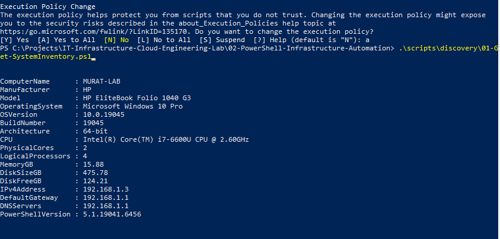

# PowerShell Infrastructure Automation

## Objective

This lab introduces PowerShell-based infrastructure automation using the
hybrid infrastructure created in Project 01.

The objective is to replace repetitive manual infrastructure checks with
reusable PowerShell scripts.

The automation covers:

- Windows system inventory
- Network connectivity validation
- Active Directory health validation
- DNS validation
- Infrastructure reporting
- Centralized configuration

---

## System Inventory Automation

The first script collects Windows system and hardware information.

Script:

```text
scripts/discovery/01-Get-SystemInventory.ps1
```

The following information is collected:

- Computer name
- Manufacturer
- Hardware model
- Operating system
- OS version and build
- CPU
- Physical and logical processors
- Memory
- Disk capacity
- Available disk space
- IPv4 address
- Default gateway
- DNS servers
- PowerShell version

The script uses Windows CIM and networking cmdlets including:

```powershell
Get-CimInstance
Get-NetIPAddress
Get-NetRoute
Get-DnsClientServerAddress
```

Information from different sources is combined into a PowerShell custom
object using:

```powershell
[PSCustomObject]
```

This creates structured data that can later be exported, filtered or used
for reporting.

---

## PowerShell Pipeline

PowerShell uses the pipeline operator:

```powershell
|
```

to pass objects between commands.

Example:

```powershell
Get-NetIPAddress -AddressFamily IPv4 |
    Where-Object {
        $_.IPAddress -notlike "127.*" -and
        $_.IPAddress -notlike "169.254.*"
    }
```

Unlike traditional text-based shell pipelines, PowerShell pipelines pass
structured .NET objects between commands.

---

## Validation

The inventory script was executed successfully on the Windows host.



The script successfully collected operating system, hardware, storage and
network configuration information from the host.

---

## Result

Manual system discovery commands were consolidated into a reusable
PowerShell inventory script.

This provides the foundation for infrastructure discovery, monitoring and
reporting automation.