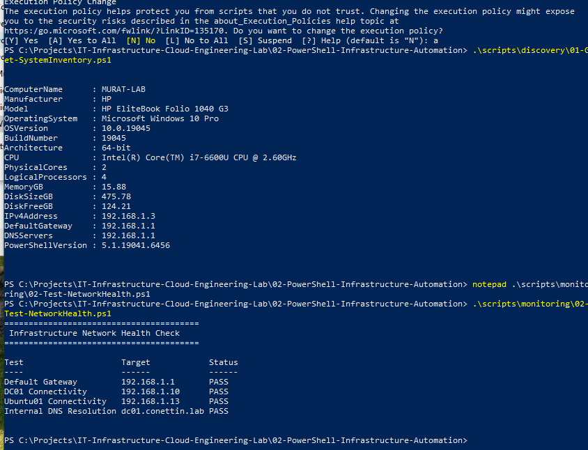
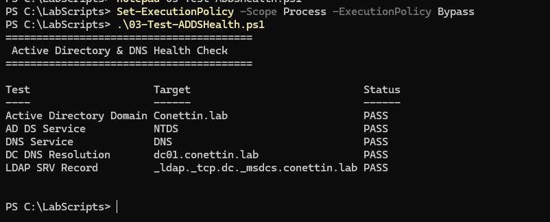

# Infrastructure Health Checks

## Objective

Automate infrastructure connectivity, Active Directory and DNS validation
across the hybrid lab environment.

The environment contains:

- Windows host
- DC01
- Ubuntu01
- Active Directory Domain Services
- DNS Server

---

## Network Health Check

Script:

```text
scripts/monitoring/02-Test-NetworkHealth.ps1
```

The script validates connectivity to:

- Default gateway: `192.168.1.1`
- DC01: `192.168.1.10`
- Ubuntu01: `192.168.1.13`

It also validates internal DNS resolution for:

```text
dc01.conettin.lab
```

Connectivity is tested using:

```powershell
Test-Connection
```

Internal DNS is validated using:

```powershell
Resolve-DnsName
```

The script converts the results into standardized:

```text
PASS
FAIL
```

states.

### Validation



All network and DNS validation tests completed successfully.

---

## Active Directory and DNS Health Check

Script:

```text
scripts/active-directory/03-Test-ADDSHealth.ps1
```

This script was executed on DC01 because Active Directory-specific
validation requires access to the AD DS environment.

The following components are validated:

- Active Directory domain
- NTDS service
- DNS service
- Domain Controller DNS resolution
- LDAP SRV service discovery record

The Active Directory domain is validated using:

```powershell
Get-ADDomain
```

Core infrastructure services are validated using:

```powershell
Get-Service NTDS
Get-Service DNS
```

DNS resolution is tested using:

```powershell
Resolve-DnsName dc01.conettin.lab -Server 192.168.1.10
```

Active Directory service discovery is validated using the LDAP SRV record:

```text
_ldap._tcp.dc._msdcs.conettin.lab
```

### Validation



The validation returned:

```text
Active Directory Domain   PASS
AD DS Service             PASS
DNS Service               PASS
DC DNS Resolution         PASS
LDAP SRV Record           PASS
```

---

## Automation Logic

The scripts use conditional logic to evaluate infrastructure state.

Example:

```powershell
if ($Success) {
    "PASS"
}
else {
    "FAIL"
}
```

Operations that may fail, such as DNS queries, use structured error
handling:

```powershell
try {
    # Perform validation
}
catch {
    # Handle failure
}
```

This allows infrastructure checks to produce consistent results instead of
requiring manual interpretation.

---

## Result

Network, Active Directory and DNS validation tasks that were performed
manually in Project 01 are now automated using reusable PowerShell scripts.